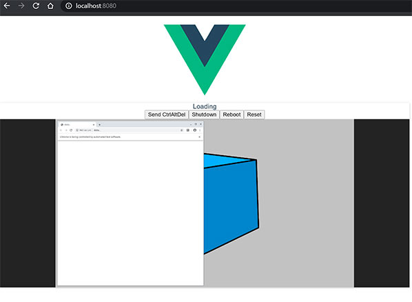

# Frame Selenoid
 ### noVnc окно в Vue.js приложеннии
Окно просмотра исполняемой страницы ботом(js/Vue.js/noVNC)  
Включаем noVnc для Selenoid контейнера  
    

### Установка
распаковать lib-novnc.7z  
далее
 ```sh
npm install
```
### Запуск
```sh
 npm run serve
```

### Настройка
src\components\segmentfault.vue
```js
 url: 'ws://192.168.99.105:4444/vnc/40ec9a1416f7b41c303615c2605745b0',
```

