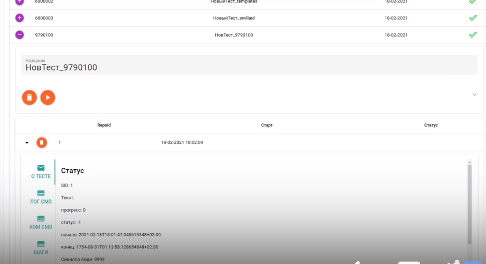

# Autotest Tools

В этом репозитарии некоторые из модулей которые вошли в состав программного обеспечения Сивилла предназначенного для Автотестирования на основе WebDriver

- [README - BotScript-wdio](BotScript-wdio/README.md)  
    Ходим по странице роботом с помощью WebDriver (js/wdio)
- [README - SeverEmulator-lite](SeverEmulator-productionPage/README.md)
    Тестовая страница как точная копия целевой WebServer (js/express)(это кеш, не har)
- [README - FrameSelenoid-vueVnc](FrameSelenoid-vueVnc/README.md)
    Окно просмотра исполняемой страницы ботом(js/Vue.js/noVNC)
- [README - FrameSelenoid-reactVnc](FrameSelenoid-reactVnc/README.md)
    Окно просмотра исполняемой страницы ботом(js/react/noVNC)
    
      